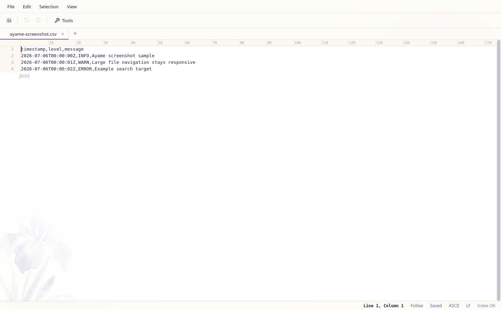

# Ayame Editor

*日本語版: [README.ja.md](README.ja.md)*

A fast desktop text editor for huge files.

Runs on macOS, Windows, and Linux.

> **Comparing files?** Comparison moved to the sister project
> **[ayame-diff](https://github.com/hjosugi/ayame-diff)**. Ayame Editor v0.7.0
> removes its `diff` / `sortdiff` implementations and two-file comparison UI.
> See the [migration guide](docs/MIGRATING_TO_AYAME_DIFF.md).



## Features

- View, search, and edit huge files without loading the whole file into memory.
- Supports UTF-8, Shift_JIS, EUC-JP, and ASCII.
- Run search, replace, sort, folder grep, and file splitting from the GUI.
- Use CLI commands such as `stat`, `head`, `tail`, `line`, `lines`, `search`, `sort`, `replace`, `case`, `split`, `group`, `top`, `distinct`, `gen`, `serve`, `cache`, `update`, and `remove`.
- Includes tabs, rectangular selection, multi-cursor editing, and tail-follow mode.
- Customizable themes, fonts, wrapping, whitespace display, and key bindings.

## Install

Download the build for your OS from the
[latest release](https://github.com/hjosugi/ayame-editor/releases/latest).

- macOS: `Ayame.app`
- Windows: `ayame-*.exe`
- Linux: single executable

You can also install from the terminal.

Scoop users can install from this repository bucket:

```powershell
scoop bucket add ayame-editor https://github.com/hjosugi/ayame-editor
scoop install ayame
```

macOS:

```sh
curl -fsSL https://raw.githubusercontent.com/hjosugi/ayame-editor/main/scripts/install.sh | sh
```

Windows (PowerShell):

```powershell
pwsh -NoProfile -Command "irm https://raw.githubusercontent.com/hjosugi/ayame-editor/main/scripts/install.ps1 | iex"
```

Linux:

```sh
curl -fsSL https://raw.githubusercontent.com/hjosugi/ayame-editor/main/scripts/install.sh | sh
```

Update later with `ayame update`. Remove a standalone install with
`ayame remove --yes`. Nix-managed binaries should be updated or removed through
Nix instead of self-modifying `/nix/store`.

Homebrew tap templates are in `packaging/homebrew/` for publishing
`brew install --cask hjosugi/tap/ayame` and `brew install hjosugi/tap/ayame`.

## Sister Project

[ayame-diff](https://github.com/hjosugi/ayame-diff) handles text, sorted-text,
CSV/TSV, directory, archive, binary, and three-way comparisons from its CLI or
GUI. Use Ayame Editor to open and edit huge files, and ayame-diff to compare them.

## More

The docs site includes the user guide, full CLI reference, architecture notes,
default shortcuts, install notes, build steps, and Linux runtime packages:
[docs site](https://hjosugi.github.io/ayame-editor/).

For files where a single wrong byte is unacceptable, see the
[data integrity guarantees](docs/DATA_INTEGRITY.md) — the correctness promises
(byte-exact save, crash recovery, encoding round-trips) and the tests that
verify each one.

## License

0BSD. You can use, copy, modify, and distribute this project for almost any purpose.
