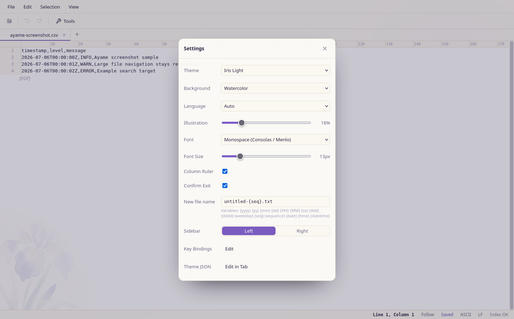
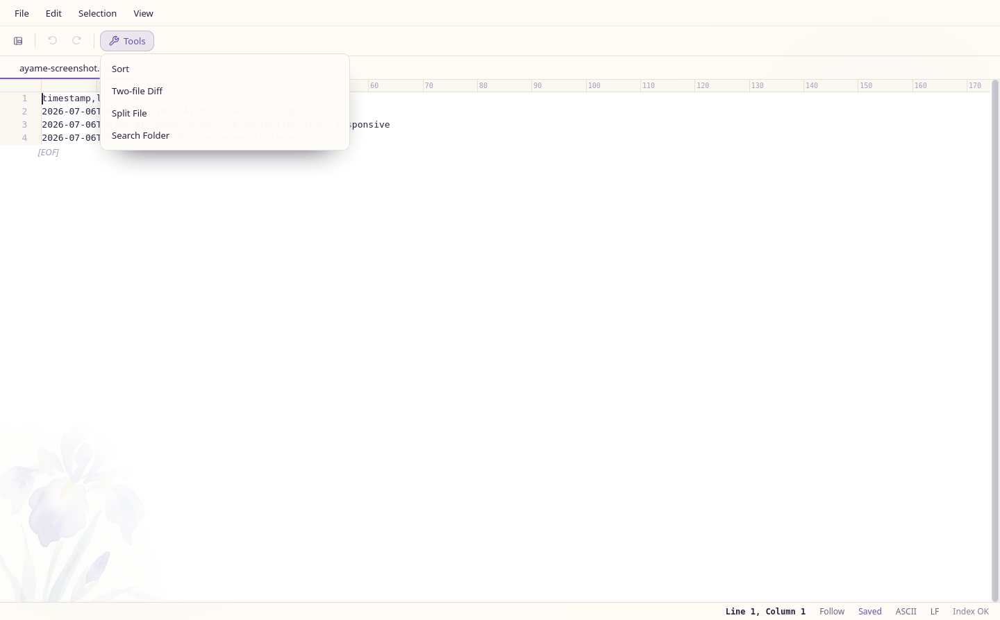
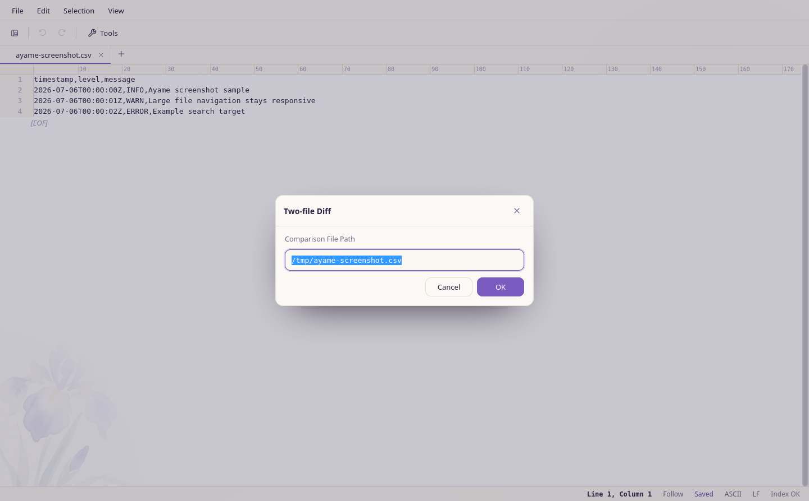

# User Guide

*日本語版: [ja/USER_GUIDE.md](ja/USER_GUIDE.md)*

Ayame Editor is a desktop text editor for huge files. Use the native app for normal editing, or the local web editor when you want to keep it in a browser.

## Install

Download the build for your OS from the [latest release](https://github.com/hjosugi/ayame-editor/releases/latest).

- macOS: `Ayame.app`
- Windows: `ayame-*.exe`
- Linux: single executable

Terminal install:

```sh
curl -fsSL https://raw.githubusercontent.com/hjosugi/ayame-editor/main/scripts/install.sh | sh
```

Windows PowerShell:

```powershell
pwsh -NoProfile -Command "irm https://raw.githubusercontent.com/hjosugi/ayame-editor/main/scripts/install.ps1 | iex"
```

## Open Files

```sh
ayame path/to/file.log
```

Open without a file:

```sh
ayame
```

Run the browser-based editor:

```sh
ayame serve path/to/file.log --port 8777
```

Then open `http://127.0.0.1:8777/`.

## Screenshots

### Main Window


### Settings and Theme



### Tools



### Two-file Diff



## CLI Commands

```sh
ayame stat huge.csv
ayame head huge.log -n 20
ayame tail huge.log -n 200
ayame line huge.log 500000
ayame lines huge.log 500000 50
ayame search huge.log 'ERROR' -i --max 50
ayame diff old.csv new.csv --side-by-side
ayame sort huge.csv --out sorted.csv
ayame sortdiff old.csv new.csv -k 1 --summary
ayame replace huge.log ERROR WARN --out fixed.log
ayame case huge.csv lower --out lower.csv
ayame split huge.csv --lines 1000000
ayame group huge.csv -k 3 --value 5
ayame top huge.csv -k 2 -n 100 --numeric
ayame distinct huge.csv -k 4
ayame gen sample.csv --lines 100000
ayame cache info
ayame serve huge.csv --port 8777
```

These examples match the current `ayame --help` output. `sort --out <FILE>`
writes sorted text to a file; without `--out`, `sort` writes to stdout.
`replace` and `case` require `--out <FILE>`. `split` writes parts next to the
input by default, using `<stem>.partNNNN<.ext>` names. Output commands refuse to
overwrite existing files, so choose a new path when the target already exists.

Use [CLI Reference](CLI_REFERENCE.md) or `ayame --help` for the full command and
option list.

## Main Features

- Opens huge files without loading the whole file into memory.
- Supports UTF-8, Shift_JIS, EUC-JP, and ASCII. If text is garbled, reopen with an explicit encoding.
- Supports literal search, regex search, whole-word search, and case-insensitive search.
- Provides editing, undo / redo, rectangular selection, multi-cursor editing, and saving a selection to a file.
- Runs sort, replace, two-file diff, folder grep, split, and ASCII upper/lower conversion from the GUI.
- Includes tabs, an explorer, recent files, and tail-follow mode for appended logs.
- Lets you customize themes, fonts, wrapping, whitespace display, zenkaku-space underline, and key bindings.
- Keeps a crash-recovery log for unsaved edits.

## Default Shortcuts

`Ctrl` can be entered as `Cmd` on macOS. Shortcuts can be changed from
`Settings` -> `Key Bindings`.

### Bindable Actions

| Action | Default shortcut |
| --- | --- |
| New file | `Ctrl+N` |
| New window | `Ctrl+Shift+N` |
| Open | `Ctrl+O` |
| Save | `Ctrl+S` |
| Save as | `Ctrl+Shift+S` |
| Close tab | `Ctrl+W`, `Alt+W` |
| Command palette | `Ctrl+Shift+P` |
| Toggle explorer | `Ctrl+B` |
| Find | `Ctrl+F` |
| Replace | `Ctrl+H` |
| Next / previous match | `F3`, `Shift+F3` |
| Go to line | `Ctrl+G` |
| Undo / redo | `Ctrl+Z`, `Ctrl+Y` or `Ctrl+Shift+Z` |
| Select all | `Ctrl+A` |
| Select next occurrence | `Ctrl+D` |
| Add cursor above / below | `Ctrl+Alt+↑`, `Ctrl+Alt+↓` |
| Duplicate line | `Ctrl+Shift+D` |
| Move line up / down | `Alt+↑`, `Alt+↓` |
| Delete line | `Ctrl+Shift+K` |
| Copy / cut | `Ctrl+C`, `Ctrl+X` |
| Search options: case / word / regex | `Alt+C`, `Alt+W`, `Alt+R` |
| Sort and overwrite current file | Unassigned |
| Diff with another file | Unassigned |
| Split current file | Unassigned |
| Grep a folder | Unassigned |
| Transform selection to uppercase / lowercase | Unassigned |
| Settings | Unassigned |
| Key bindings | Unassigned |
| Close the find bar or a dialog | `Esc` |

Unassigned actions appear in `Settings` -> `Key Bindings`; assign a shortcut if
you use them often.

### Menu and Status Operations

These commands have no default key binding in the current build. Open them from
the menu, status bar, or command palette (`Ctrl+Shift+P`) where listed.

| Operation | Where to open it |
| --- | --- |
| Follow Tail (`tail -f`) | `View` -> `Follow Tail`, status tail button, or command palette |
| Show whitespace and line endings | `View` -> `Show Whitespace and Line Endings` or command palette |
| Underline full-width spaces | `View` -> `Underline Full-width Spaces` or command palette |
| Word wrap | `View` -> `Word Wrap` or command palette |
| Convert encoding / line endings and save | `File` -> `Encoding / Line Endings...`, or click the encoding/EOL status segment |
| Reopen with a different encoding | Open `Encoding / Line Endings...`, choose an encoding, then use `Reopen` |
| Save selection to file | Selection context menu |
